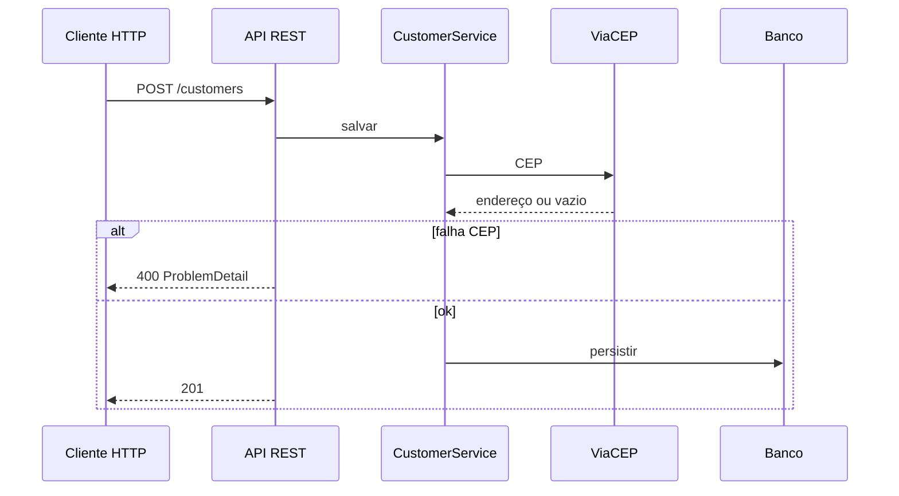

# 01 — Visão geral: o que o sistema faz

Documentação **não técnica primeiro**: propósito, comportamento e limites. Contratos e código: [02-referencia-tecnica.md](02-referencia-tecnica.md). Papéis: [03-papeis.md](03-papeis.md).

---

## Em uma frase

Serviço HTTP que **cadastra, consulta, altera e exclui clientes**, valida **CPF** e **CEP**, e **preenche o endereço** consultando a API pública **ViaCEP**.

---

## Público e uso

| Perfil | Uso típico |
|--------|------------|
| Integrador / cliente HTTP | Consome REST para gerir clientes |
| Engenharia | Estuda **hexagonal** com Spring Boot |
| Produto / gestão | Entende **recorte** da POC (um domínio, sem login comercial, etc.) |

---

## Comportamento (cadastro e alteração)

1. Entrada: **nome**, **CPF** (11 caracteres), **data de nascimento** (opcional), **CEP** (8 caracteres).
2. Validação de CPF e CEP no **domínio** (além da validação do JSON).
3. Consulta ao **ViaCEP** com o CEP.
4. Se o CEP não existir ou a resposta for inválida → operação **falha** (não persiste).
5. Se existir → o endereço enviado é **substituído** pelos dados retornados (logradouro, bairro, cidade, UF…), CEP **sem hífen**.
6. Persistência no banco (na configuração padrão: **H2 em memória**).

O CEP do request é só a **chave**; o endereço gravado é o **enriquecido** pelo ViaCEP.

## Consulta, listagem e exclusão

- **GET por id:** cliente com endereço persistido.
- **GET lista:** todos; se vazia, comportamento conforme [02-referencia-tecnica.md](02-referencia-tecnica.md) (204 vs corpo vazio).
- **DELETE:** por id; id inexistente → não encontrado.

---

## O que não está no escopo (POC)

- Autenticação / autorização  
- **Unicidade de CPF** no banco (ver também [04-modelo-dados.md](04-modelo-dados.md))  
- Front-end neste repositório  
- Dados **duráveis** com H2 in-memory + `create-drop` (somem ao desligar)  
- Produto “maduro”: retries, circuit breaker, métricas, hardening de ViaCEP  

---

## Diagrama de fluxo (cadastro)



---

## Exemplo de JSON

**POST /customers**

```json
{
  "name": "Maria Example",
  "taxIdNumber": "12345678901",
  "birthday": "1990-05-15",
  "address": { "zipCode": "01310100" }
}
```

Sucesso: **201** sem corpo. **GET /customers/{id}** devolve o cliente com `address` preenchido (conteúdo depende do ViaCEP).

---

## Índice da documentação

Voltar ao hub: [README.md](README.md).
