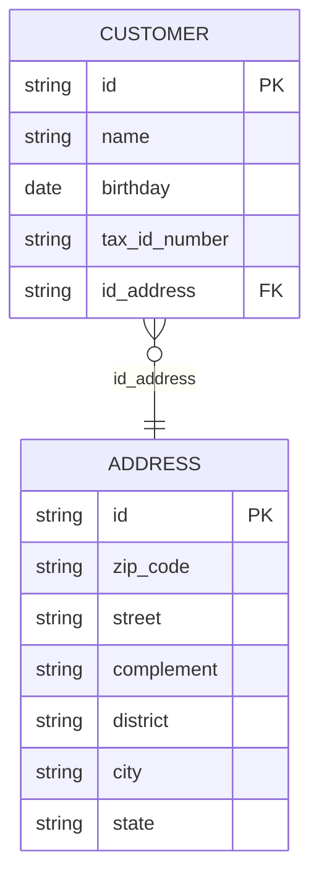

# 04 — Modelo de dados (DBA) e DDL

Análise do **modelo físico** das entidades JPA, **riscos** (app vs schema) e scripts **`CREATE TABLE`**. Índice: [README.md](README.md). Visão de produto: [01-visao-geral.md](01-visao-geral.md).

---

## 1. Visão do modelo (lógico)



Relacionamento JPA: **`Customer` → `@ManyToOne` `Address`** com `CascadeType.ALL` e FK **`id_address`**. No relacional, **N clientes podem referenciar um mesmo endereço** (o fluxo atual tende a criar endereço novo por gravação).

---

## 2. Riscos e inconsistências

### 2.1 Cardinalidade vs semântica

- Semântica quase **1:1** (endereço “do” cliente); modelo **ManyToOne** sem `@JoinColumn(nullable = false)` nem `unique` em `id_address`.
- **Risco:** vários clientes no mesmo `address.id`; **`id_address` NULL** possível no banco apesar da API exigir endereço.

### 2.2 Regras só na aplicação

| Regra na API / domínio | No banco? |
|------------------------|-----------|
| `name` obrigatório | Coluna pode ser NULL |
| CPF 11 caracteres | `length` 11; NULL usualmente permitido |
| CEP 8 caracteres | `length` 8; nullable típico |
| Unicidade CPF | Sem `UNIQUE` |

### 2.3 `CascadeType.ALL` em `@ManyToOne`

Padrão atípico; risco se houver **compartilhamento** de endereço. Alternativa comum: **`OneToOne`** + FK **NOT NULL** se endereço não for compartilhado.

### 2.4 Outros

- `varchar(255)` em logradouro/cidade — casos longos podem estourar.
- Sem índice de negócio (CPF, CEP) além de PK/FK.
- `@UuidGenerator` vs `GenerationType.UUID` — estilo diferente, mesmo efeito prático.
- **H2 + `create-drop`:** sem Flyway/Liquibase; schema só nas entidades.

---

## 3. DDL — H2 (fiel ao código atual)

```sql
-- POC hexagonal — H2 (CustomerEntity / AddressEntity)

DROP TABLE IF EXISTS customer;
DROP TABLE IF EXISTS address;

CREATE TABLE address (
  id          VARCHAR(255) NOT NULL,
  zip_code    VARCHAR(8),
  street      VARCHAR(255),
  complement  VARCHAR(255),
  district    VARCHAR(255),
  city        VARCHAR(255),
  state       VARCHAR(2),
  CONSTRAINT pk_address PRIMARY KEY (id)
);

CREATE TABLE customer (
  id             VARCHAR(255) NOT NULL,
  name           VARCHAR(255),
  birthday       DATE,
  tax_id_number  VARCHAR(11),
  id_address     VARCHAR(255),
  CONSTRAINT pk_customer PRIMARY KEY (id),
  CONSTRAINT fk_customer_address FOREIGN KEY (id_address) REFERENCES address (id)
);

-- Opcional (não aplicado pelo código atual):
-- CREATE UNIQUE INDEX uq_customer_tax_id ON customer (tax_id_number);
```

---

## 4. DDL endurecido (referência de evolução)

Não corresponde ao JPA atual sem mudar entidades e migrações:

```sql
CREATE TABLE address (
  id          VARCHAR(36)  NOT NULL,
  zip_code    VARCHAR(8)   NOT NULL,
  street      VARCHAR(255) NOT NULL,
  complement  VARCHAR(255),
  district    VARCHAR(255) NOT NULL,
  city        VARCHAR(255) NOT NULL,
  state       CHAR(2)      NOT NULL,
  CONSTRAINT pk_address PRIMARY KEY (id),
  CONSTRAINT ck_address_state_len CHECK (CHAR_LENGTH(state) = 2)
);

CREATE TABLE customer (
  id             VARCHAR(36)  NOT NULL,
  name           VARCHAR(255) NOT NULL,
  birthday       DATE,
  tax_id_number  CHAR(11)     NOT NULL,
  id_address     VARCHAR(36)  NOT NULL,
  CONSTRAINT pk_customer PRIMARY KEY (id),
  CONSTRAINT fk_customer_address FOREIGN KEY (id_address) REFERENCES address (id),
  CONSTRAINT uq_customer_tax_id UNIQUE (tax_id_number)
);

CREATE INDEX idx_address_zip_code ON address (zip_code);
```

---

## 5. Checklist

- [ ] CPF único no banco?
- [ ] `id_address` obrigatório e 1:1?
- [ ] Política de exclusão (órfãos)?
- [ ] SGBD alvo + ferramenta de migração?
- [ ] Tamanhos de coluna suficientes?

---

*Fonte: `adapters/out/persistence/customer/entities/`, `application.properties`.*

[← Índice](README.md)
