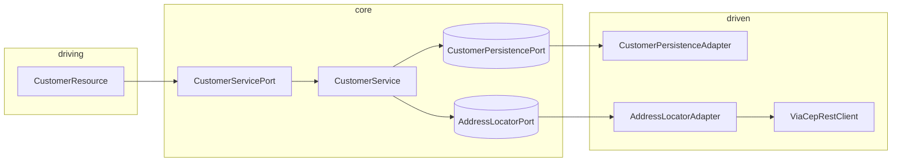

# 05 — Revisão multidisciplinar

Uso: **retrospectiva**, **onboarding de time** ou **orquestração** de achados. Não duplica o detalhe por papel — isso está em [03-papeis.md](03-papeis.md).

---

## Síntese

O `poc-hexagonal` expõe **CRUD de clientes** com **ViaCEP** e **arquitetura hexagonal** (núcleo com portas, adaptadores na borda). É **POC / estudo**: não há auth, persistência durável na config padrão, nem endurecimento operacional completo.

---

## Arquitetura (hexágono)

---

## Tensões (decisão pendente)

| Tensão | Direção sugerida |
|--------|------------------|
| CEP inválido no POST → hoje **400** | Avaliar **422** ou contrato explícito com clientes |
| Lista vazia → **204** vs **200** + `[]` | Padronizar com consumidores |
| ViaCEP indisponível | Timeout, retry limitado ou cache |
| Mensagens de exceção / i18n | Completar `messages*.properties` |
| Schema vs app (NULL, UNIQUE CPF) | Ver [04-modelo-dados.md](04-modelo-dados.md) |

---

## Próximos passos sugeridos

1. Manter [02-referencia-tecnica.md](02-referencia-tecnica.md) alinhado a mudanças de API ou modelo.
2. Opcional: `docs/adr/` para decisões transversais.
3. Opcional: testes de integração; perfil `prod` (datasource externo, sem `show-sql`).
4. CI com **Java 21** e `mvn verify`.

---

[← Índice](README.md) · [03 Papéis](03-papeis.md)
